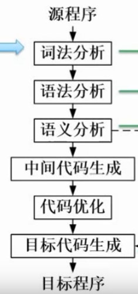

# 1 计算机组成与结构
## 1.1数的表示
### 原码补码反码移码
**原码**

范围：-(pow(2,n-1)-1)~pow(2,n-1)-1

1：0000 0001

-1：1000 0001

*原码的0只有0000 0000

**反码**

范围：-(pow(2,n-1)-1)~pow(2,n-1)-1

1: 0000 0001

-1: 1111 1110

符号位不变，有效位取反

有两个0

**补码**

范围：-pow(2,n-1)~pow(2,n-1)-1

1：0000 0001

-1：1111 1111

只有1个0：0000 0000

### 浮点数表示

N=M*R^e

M:尾数

R:基数

e:指数

计算过程：对阶->尾数计算->规范化

## 1.2 CPU结构

ALU:

AC:

DR:

PSW:存储运算过程中的标志位

PC:存储下一条指令的地址

IR:

指令译码器:

时许部件:

## 1.3 计算机体系结构分类Flynn

## 1.4 CISC and RISC

RISC特点：

## 1.5 流水线
### **流水线执行时间计算**
取指->分析->执行

流水线周期:max(取指,分析,执行)

一条指令执行时间+(n-1)*流水线周期

### **吞吐率计算**
TP=指令条数/流水线执行时间

max_TP=1/流水线周期

### **加速比**
S=不使用流水线的执行时间/使用流水线的执行时间

### **流水线效率**

## 1.6 层次化存储结构

### **Cache的基本概念**
使用"Cache+主存"的系统的平均周期为t3

Cache周期时间为t1

主存周期时间t2

访问命中率h

t3=h*t1+(1-h)*t2

### **局部性原理**

**时间局部性**:如果程序中的某条指令一旦执行，不久以后该指令可能再次执行;如果某数据被访问过，不久以后该数据可能再次被访问。产生时间局部性的典型原因，是由于在程序中存在着大量的循环操作。

**空间局部性**:一旦程序访问了某个存储单元，在不久之后，其附近的存储单元也将被访问，即程序在一段时间内所访问的地址，可能集中在一定的范围之内，这是因为指令通常是顺序存放、顺序执行的，数据也一般是以向量、数组、表等形式簇聚存储的。

**工作集理论**:工作集是进程运行时被频繁访问的页面集合

### 1.6.1 随机存储器和只读存储器
### 分类

### 主存的编址

### 磁盘工作原理

视频特殊题！

存取时间=寻道时间+等待时间(平均定位时间+转动延迟)
### 1.6.2 计算机总线
根据总线所处位置不同，可以分为：

·内部总线

·系统总线

(1)数据总线

(2)地址总线

(3)控制总线

·外部总线

### 1.6.3 串并联可靠度计算

## 1.7 校验码

### 1.7.1 基本概念

### 1.7.2 循环校验CRC

### 1.7.3 海明校验码

# 2 程序语言
## 2.1编译过程

编译型语言:

解释型语言:

**编译过程**

词法分析:非法字符，关键字或标识符拼写错误

语法错误:语法结构出错，if，endif不匹配

语义错误:死循环，零除数，其他逻辑错误

## 2.2 文法
# 3 OS
## 3.1 进程状态转换图

五态模型： 加入了人为挂起

## 3.2 前驱图
表示活动的先后关系

## 3.3 同步与互斥
一些PV操作的题，自己做吧

## 3.4 进程管理
**死锁四大条件**

·互斥

·保持和等待

·不剥夺

·环路等待

**死锁的预防**

打破四大条件

**死锁的避免**

资源有序分配

银行家算法

### 3.4.1 银行家算法*

答案：C

## 3.5 存储管理

**首次适应算法**

**最佳适应算法**

**最差适应法**

**循环首次适应法**

### 3.5.1 位示图
位示图用于表示物理块的存储情况，若字长为32位，则一个字可以表示32个物理块的存储情况
# 软件工程

# 系统开发与运行

# 网络与多媒体

# 数据库

# 算法与数据结构

# 面向对象

# 知识产权

# 专业英语