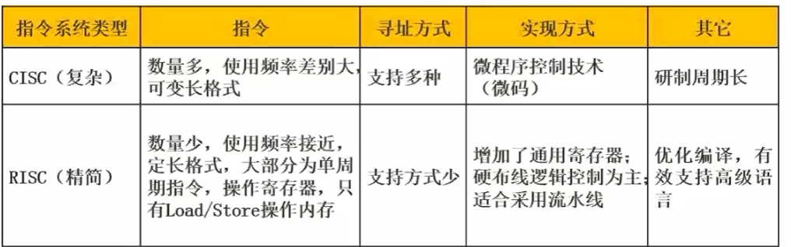

# 1 计算机组成与结构
## 1.1数的表示
### 原码补码反码移码
**原码**

范围：-(pow(2,n-1)-1)~pow(2,n-1)-1

1：0000 0001

-1：1000 0001

*原码的0只有0000 0000

**反码**

范围：-(pow(2,n-1)-1)~pow(2,n-1)-1

1: 0000 0001

-1: 1111 1110

符号位不变，有效位取反

有两个0

**补码**

范围：-pow(2,n-1)~pow(2,n-1)-1

1：0000 0001

-1：1111 1111

只有1个0：0000 0000
### 定点数表示

### 浮点数表示

浮点数表示不唯一，阶码决定范围，尾数决定精度

**规格化**:尾数绝对值在[0.5,1]

N=F*2^e

F:尾数

R:基数

e:指数

计算过程：小对大阶->尾数右移n位->尾数计算->规范化

## 1.2 CPU结构

**ALU**:算术逻辑单元

**AC**:累加寄存器

**DR**:数据缓冲寄存器

PSW:存储运算过程中的标志位

**PC**:存储下一条指令的地址，程序员可以访问

IR:

指令译码器:

时许部件:
### 1.2.1 指令寻址

获取操作数的速度:立即寻址>寄存器寻址>直接寻址

## 1.3 计算机体系结构分类Flynn

## 1.4 CISC and RISC

CISC比RISC高级

二者都使用流水线

CISC采用很少的通用寄存器，RISC采用很多的通用寄存器
## 1.5 流水线
### **流水线执行时间计算**
取指->分析->执行

流水线周期:max(取指,分析,执行)

一条指令执行时间+(n-1)*流水线周期

### **吞吐率计算**
TP=指令条数/流水线执行时间

max_TP=1/流水线周期

### **加速比**
S=不使用流水线的执行时间/使用流水线的执行时间

### **流水线效率**

## 1.6 层次化存储结构

### **Cache的基本概念**
使用"Cache+主存"的系统的平均周期为t3

Cache周期时间为t1

主存周期时间t2

访问命中率h

t3=h*t1+(1-h)*t2

**直接映射**:

**全相联映射**:

**组相联映射**:

### **局部性原理**

**时间局部性**:如果程序中的某条指令一旦执行，不久以后该指令可能再次执行;如果某数据被访问过，不久以后该数据可能再次被访问。产生时间局部性的典型原因，是由于在程序中存在着大量的**循环操作**。

**空间局部性**:一旦程序访问了某个存储单元，在不久之后，其附近的存储单元也将被访问，即程序在一段时间内所访问的地址，可能集中在一定的范围之内，这是因为指令通常是顺序存放、顺序执行的，数据也一般是以向量、数组、表等形式簇聚存储的。

**工作集理论**:工作集是进程运行时被频繁访问的页面集合

### 1.6.1 随机存储器和只读存储器
### 分类(按访问方式分类)

**按地址访问**:

**按内容访问**:相联存储器

### 分类(按工作方式)

#### 读/写存储器

**DRAM**: 集成率较低，功耗大，动态刷新

**SRAM**: 集成率较高，功耗小，

#### 只读存储器

**ROM**:

**PROM**:

**flash memory**:
### 主存的编址

### 磁盘工作原理

视频特殊题！

存取时间=寻道时间+等待时间(平均定位时间+转动延迟)
### 1.6.2 计算机总线
根据总线所处位置不同，可以分为：

·内部总线

·系统总线

(1)数据总线

(2)地址总线

(3)控制总线

·外部总线

### 1.6.3 串并联可靠度计算

## 1.7 校验码

### 1.7.1 基本概念

### 1.7.2 循环校验CRC

### 1.7.3 海明校验码
假设数据位n位，校验位k位
则要求2^k-1>=n+k

# 2 程序语言

## 2.1编译过程

**编译:** 词法分析、语法分析、语义分析、中间代码生成、代码优化、生成目标代码

**解释:**

**编译型语言**:直接解释执行源程序，或者将源程序转换成中间代码

**解释型语言**:直接将原程序翻译成目标机器语言

**解释器**:

(1)翻译源程序时不产生独立的目标程序

(2)解释程序和源程序要参与到程序的运行过程中

**编译器**:

(1)翻译时将源程序翻译成独立保存的目标程序

(2)机器上运行与源程序等价的目标程序。源程序与编译程序不参与目标程序的运行过程

**编译过程**

**词法分析**:非法字符，关键字或标识符拼写错误,输入是源程序(字符流)，输出是**记号流**

**语法分析**:输入时**记号流**，构造出**语法树**

**语义分析**:检查静态语义错误

**语法错误**:语法结构出错，if，endif不匹配

**中间代码生成**:与具体机器无关，可以跨平台，常见形式:后缀式、三地址码、三元式、四元式、树(图)

**目标代码生成**:该工作与具体的机器密切相关，完成寄存器的分配

### **语义错误**

**静态语义错误**:

**动态语义错误**:

**符号表**:不断收集、记录和使用源程序中一些相关符号的类型和特征等信息，并将其存入符号表中。记录源程序中各个符号的必要信息，辅助语义的正确性检查和代码生成

### 正则式
就是正则式

## 2.2 程序设计语言
顺序、选择、循环

**程序中数据必须有类型:**

(1)便于为数据分配合理的存储单元

(2)便于对参与表达式计算的数据对象进行检查

(3)便于规定数据对象的取值范围以及能够进行的运算

**常量与变量:**

(1)变量取值在程序运行时可以改变，常量不行

(2)变量具有对应储存单元，常量没有

(3)不能对常量赋值

**短路运算:**

优先级:not>and>or

**传值与引用:**

**栈区、堆区、静态数据区、代码区**

## 2.3 DFA

**DFA**:对于一个状态来说识别字符后转移的状态是唯一的

**NFA**:
## 2.4 上下文无关文法
G=(V,T,S,P)

V:非终结符，常用大写字母表示

T:终结符，常用小写字符表示

S:起始符，语言的开始符号

P:产生式，如A->b

语法树都是中缀表达式
## 2.5 中缀后缀表达式转换
优先级相同，从右向左

a?b中

ab?后

## 杂题
### 脚本语言

**例子**: php、JavaScript

**特征**:

(1)属于动态语言，程序结构可以在运行中改变

(2)通过脚本引擎解释执行，不产生独立保存的目标程序

### 标记语言

**例子**:HTML,XML,WML

# 3 OS
## 3.1 进G程状态转换图

五态模型： 加入了人为挂起

## 3.2 前驱图
表示活动的先后关系

## 3.3 同步与互斥
一些PV操作的题，自己做吧

## 3.4 进程管理
**死锁四大条件**

·互斥

·保持和等待

·不剥夺

·环路等待

**死锁的预防**

打破四大条件

**死锁的避免**

资源有序分配

银行家算法

### 3.4.1 银行家算法*

答案：C

## 3.5 存储管理
### 3.5.1 分区存储组织

**首次适应算法**

**最佳适应算法**

**最差适应法**

**循环首次适应法**

### 3.5.2 页式，段式，段页式存储
页式

高级程序语言使用逻辑地址

运行状态，内存中使用物理地址

段式

段页式

先分段再分页

### 3.5.3 页面淘汰算法

OPT()

FIFO()

LRU()

## 3.6 文件管理
### 3.6.1 位示图
位示图用于表示物理块的存储情况，若字长为32位，则一个字可以表示32个物理块的存储情况

字从1开始算

位置从0开始算
### 3.6.1 索引文件结构

索引节点默认为13个，即13个32bit地址

直接：索引直接存储物理盘块地址

二级：索引指向一个用于存储盘块地址的盘块

三次：二的基础上继续
### 3.6.2 树型目录结构

对于F2而言，现在目录位于D1

绝对路径：/D1/W2

相对路径：W2/
## 3.7 设备管理
### 3.7.1 I/O传输控制方式

**程序控制(查询)方式**：CPU主动查询外设的状态，在外设准备好时传输数据

(1)CPU和外设只能串行工作，CPU一直轮询

(2)一次只能读/写一个字

(3)由CPU将数放入内存

**程序中断方式**：外设向CPU传送状态

(1)I/O设备通过中断信号主动报告I/O操作完成

(2)CPU和I/O设备可以并行工作

(3)CPU将数据放入内存

**DMA方式(直接存储器读取)**：由DMA控制器接管CPU和外设的数据传输工作，每传送一个数据占用一个存储周期

(1)CPU与I/O并行工作

(2)仅在传输数据块的开始和结束时才需要CPU干预

(3)由外设之间将数据块放入内存

(4)以块为单位
### 3.7.2 磁盘调度经典例题
访问一个数据块的时间=寻道时间+旋转延迟时间+传输时间

（1）磁盘块与缓冲区

从盘块读入缓冲区t1

从缓冲区送至用户区t2

系统数据处理时间t3

·单缓冲区

·双缓冲区

（2）磁盘调度算法

·FCFS

·SSTF

·SCAN

·CSCAN

## 3.8 作业管理
前驱图知识
# 4 软件工程

## 4.1 概述

## 4.2 项目管理
### 4.2.1 活动图

## 4.3 质量管理

## 4.4 过程管理

## 4.5 风险管理

### 风险控制基本方法

(1)风险回避

(2)损失控制

(3)风险转移

(4)风险保留

# 5 系统开发与运行
## 5.1 结构化分析和设计

## 5.2 系统设计知识

## 5.3 系统测试与维护
# 6 网络与多媒体
## 6.1 ISO/OSI
### 6.1.1 OSI/RM 七层模型

## 6.2 网络互联硬件
## 6.3 网络协议

## 多媒体计算机
表示媒体：XX编码

表现媒体：信息输入输出的媒体

感觉媒体：直接作用于人体感官的，使人直接产生感觉的媒体

存储媒体：硬盘，软盘，光盘，胶卷

传输媒体：电缆，光缆
# 7 数据库
## 7.1 基础知识
### 7.1.1 三级模式

内模式：数据存储到物理文件，文件存储模式，引元、索引、存储路径等数据的存储组织

模式：表，表数据分成若干张表

外模式：用户视图，表中涵盖的信息太多，只需取出一部分

### 7.1.2 设计过程

### 7.1.3 数据库访问方式

### 7.1.4 锁

### 7.1.5 分布式数据库

### 7.2 数据库安全

存储过程

## 7.2
# 8 算法与数据结构
## 8.1 线性结构
### 循环队列
优点:入队和出队操作都不需要移动队列中的其他元素
## 8.2 数组、矩阵、广义表
## 8.3 树
# 9 面向对象
## 9.1 基本概念
### 9.1.1 多态
**多态**:在面向对象方法中，多态是指客户类无需知道所调用方法的特定子类的实现。这就意味着客户类只需发送高层次的通用消息，具体实现根据接收对象的具体情况与现实的方法进行连接，即动态绑定

**覆盖**:子类用适合于自己要求的实现去置换父类中相应的实现

**重载**:一个类

**参数多态**:方法名称相同，但是参数不同

**包含多态**:同样的操作可以用于一个类型及其子类型，子类泛型化

**强制多态**:编译程序通过语义操作，把操作对象的类型强行加以变换

**过载多态**:同一个名在不同上下文中有不同的类型

### 9.1.2 绑定
动态绑定:执行期间判断所引用对象的实际类型，根据其实际的类型调用其相应的方法

静态绑定:编译过程中，把函数调用与响应调用所需的代码结合的过程
### 9.1.3 面向对象程序构建
**面向对象分析**

(1)认定对象

(2)组织对象

(3)描述对象间的相互作用

(4)定义对象的操作

(5)定义对象的内部信息

**面向对象设计**

(1)识别类与对象

(2)定义属性

(3)定义服务

(4)识别关系

(5)识别包
### 9.1.4 父类与子类

## 9.2 设计原则

## 9.3 设计模式

### 9.3.1 创建型模式
·**单例**:保证一个类仅有一个实例，并提供一个访问这个唯一实例的全局访问点

·**工厂方法**:定义一个用于创建对象的接口，让子类决定将哪一个类实例化，适用于当一个类不知道它所必须创建的对象的类的时候
### 9.3.2 结构型模式
·**桥接型模式**:基于类的最小设计原则，通过使用封装、聚合及继承等行为让不同的类承担不同的责任。将类的抽象部分和它的实现部分分离开，使他们可以独立变化

·**装饰模式**:不修改对象的结构前提下，动态地给一个对象添加一些额外的职责

·**组合**:
### 9.3.3 行为型模式
·**责任链模式**:给多个对象处理请求的机会，减少请求发送者和接收者之间的耦合。将接收对象连接起来，请求在链中传递

·**命令模式**:将一个请求封装为一个对象，可用不同的请求将对象参数化，将请求排队或记录请求日志，支持可撤销操作

·**解释器模式**:

·**观察者模式**:对象间的一对多依赖关系，一个对象的状态发生改变时，所有依赖于它的对象都得到通知并被自动更新

·**状态模式**:运行对象在其内部状态改变的时候改变它的行为

·**访问者模式**:

·**策略模式**:定义一系列算法，把他们封装起来，使他们可以相互交换。算法可以独立于使用他们的客户而变化。

·**中介者**:用一个中介对象来封装一系列的对象交互。如一个后端数据模型与多个前端模型连接

## 9.4 UML
### 9.4.1 部署图

### 9.4.2 构件图

(1)供需接口

供接口:棒棒糖 

需接口:半圆

(2)用于展示组件之间的组织和依赖

(3)
### 9.4.3 通信图
### 9.4.4 时序图

序列图描述了以**时间**顺序组织的对象之间的交互活动

**特征**:时间条

同步消息:

异步消息:

返回消息:
# 10 知识产权
## 10.1 著作权
作者对于
# 11 专业英语

# 12 信息安全
## 12.1 信息系统安全属性
保密性：最小授权原则，防暴露，信息加密，物理保密

完整性：安全协议，校验码，密码校验，数字签名，公证

可用性：综合保障（IP过滤，业务流控制，路由选择控制，审计跟踪）

不可抵赖性：数字签名
## 12.2 对称加密和非对称加密
加密的目的是为了防御被动攻击
### 12.2.1 对称加密(共享密钥加密)
**DES**: 替换+移位

**3DES**: 三重DES，两个密钥

加密: K1加密->K2解密->K1加密

解密：K1解密->K2加密->K1解密

**AES**:高级加密标准Rijndae加密法，是美国联邦政府采用的一种区块加密标准，**分组**加密算法

**RC-5**:RSA数据安全公司，用于对大量**明文**进行加密

**IDEA算法**:128位密钥，64位数据块，适用于数据传输加密

**RC4**：

### 12.2.2 非对称加密(公开密钥加密)
**RSA**:

**Elganmal**:

**ECC**:

**DSA**:
接收者A先将自己的公钥发送给发送方B,发送方B用A的公钥对数据进行加密，传输给A,A用自己的私钥进行解密

### 12.2.3 摘要加密算法
**MD5**:输出结果为4个32位分组，共128位

用于防止发送的报文被篡改
## 12.3 信息摘要
## 12.4 数字签名

认证的目的是防御主动攻击，确保报文发送者和接收者的真实性

为了让接收方知道数据是自己发送的，发送方A用自己的私钥进行签名，向外界发送自己的公钥，**确保消息不可否认**

### 作用
(1)B可以验证信息P确实来源于A

(2)A不能否认发送过消息P

(3)B不能编造或修改消息P
## 12.5 数字证书
如何防止冒充公钥的情况，CA介入，CA用自己的私钥对签名二次加密，接收方用CA公钥进行解密，**可以对用户进行身份验证**
### 12.5.1 数字信封
### 12.5.2 PGP
承认两种不同的证书格式：PGP证书和X.509证书

**X.509**:RSA

**国密SM2**:ECC
## 12.6 各个网络层次的安全保障
## 12.7 PKI体系
## 12.8 计算机病毒

五大特征:隐蔽性、传染性、潜伏性、触发性、破坏性

### **木马病毒**
案例:X卧底

### **宏病毒(Macro)**

案例:

危害:感染使用某些程序创建的文本文档、数据库、电子表格

### **蠕虫病毒**
案例:熊猫烧香、红色代码、欢乐时光

危害:攻击工业基础设施

传播方式:，一个程序或程序序列,利用网络进行复制和传播，通过网络，移动存储设备和电子邮件

## 12.9 计算机安全技术
**入侵检测技术**:专家系统、模型检测、简单匹配

### 12.9.1 安全需求

(1)物理线路安全:机房安全、

(2)网络安全:入侵检测、

(3)系统安全:漏洞补丁管理、

(4)应用安全:数据库安全、

## 12.10 网络攻击技术
**主动攻击**:重放、IP地址诈骗、拒绝服务攻击(Dos,DDos)、信息篡改

**被动攻击**:流量分析、

