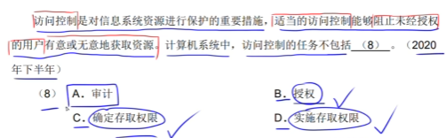

# 1 计算机组成与结构
## 1.1数的表示
### 原码补码反码移码
**原码**

范围：-(pow(2,n-1)-1)~pow(2,n-1)-1

1：0000 0001

-1：1000 0001

*原码的0只有0000 0000

**反码**

范围：-(pow(2,n-1)-1)~pow(2,n-1)-1

1: 0000 0001

-1: 1111 1110

符号位不变，有效位取反

有两个0

**补码**

范围：-pow(2,n-1)~pow(2,n-1)-1

1：0000 0001

-1：1111 1111

只有1个0：0000 0000
### 定点数表示

### 浮点数表示

浮点数表示不唯一，阶码决定范围，尾数决定精度

**规格化**:尾数绝对值在[0.5,1]

N=F*2^e

F:尾数

R:基数

e:指数

计算过程：小对大阶->尾数右移n位->尾数计算->规范化

## 1.2 CPU结构

**ALU**:算术逻辑单元

**AC**:累加寄存器

**DR**:数据缓冲寄存器

PSW:存储运算过程中的标志位

**PC**:存储下一条指令的地址，程序员可以访问

IR:

指令译码器:

时许部件:
### 1.2.1 指令寻址

获取操作数的速度:立即寻址>寄存器寻址>直接寻址

## 1.3 计算机体系结构分类Flynn

## 1.4 CISC and RISC

CISC比RISC高级

二者都使用流水线

CISC采用很少的通用寄存器，RISC采用很多的通用寄存器
## 1.5 流水线
### **流水线执行时间计算**
取指->分析->执行

流水线周期:max(取指,分析,执行)

一条指令执行时间+(n-1)*流水线周期

### **吞吐率计算**
TP=指令条数/流水线执行时间

max_TP=1/流水线周期

### **加速比**
S=不使用流水线的执行时间/使用流水线的执行时间

### **流水线效率**

## 1.6 层次化存储结构

### **Cache的基本概念**
使用"Cache+主存"的系统的平均周期为t3

Cache周期时间为t1

主存周期时间t2

访问命中率h

t3=h*t1+(1-h)*t2

**直接映射**:

**全相联映射**:

**组相联映射**:

### **局部性原理**

**时间局部性**:如果程序中的某条指令一旦执行，不久以后该指令可能再次执行;如果某数据被访问过，不久以后该数据可能再次被访问。产生时间局部性的典型原因，是由于在程序中存在着大量的**循环操作**。

**空间局部性**:一旦程序访问了某个存储单元，在不久之后，其附近的存储单元也将被访问，即程序在一段时间内所访问的地址，可能集中在一定的范围之内，这是因为指令通常是顺序存放、顺序执行的，数据也一般是以向量、数组、表等形式簇聚存储的。

**工作集理论**:工作集是进程运行时被频繁访问的页面集合

### 1.6.1 随机存储器和只读存储器
### 分类(按访问方式分类)

**按地址访问**:

**按内容访问**:相联存储器

### 分类(按工作方式)

#### 读/写存储器

**DRAM**: 集成率较低，功耗大，动态刷新

**SRAM**: 集成率较高，功耗小，

#### 只读存储器

**ROM**:

**PROM**:

**flash memory**:
### 主存的编址

### 磁盘工作原理

视频特殊题！

存取时间=寻道时间+等待时间(平均定位时间+转动延迟)
### 1.6.2 计算机总线
根据总线所处位置不同，可以分为：

·内部总线

·系统总线

(1)数据总线

(2)地址总线

(3)控制总线

·外部总线

### 1.6.3 串并联可靠度计算

## 1.7 校验码

### 1.7.1 基本概念

### 1.7.2 循环校验CRC

### 1.7.3 海明校验码
假设数据位n位，校验位k位
则要求2^k-1>=n+k

# 2 程序语言

## 2.1编译过程

**编译:** 词法分析、语法分析、语义分析、中间代码生成、代码优化、生成目标代码

**解释:**

**编译型语言**:直接解释执行源程序，或者将源程序转换成中间代码

**解释型语言**:直接将原程序翻译成目标机器语言

**解释器**:

(1)翻译源程序时不产生独立的目标程序

(2)解释程序和源程序要参与到程序的运行过程中

**编译器**:

(1)翻译时将源程序翻译成独立保存的目标程序

(2)机器上运行与源程序等价的目标程序。源程序与编译程序不参与目标程序的运行过程

**编译过程**

**词法分析**:非法字符，关键字或标识符拼写错误,输入是源程序(字符流)，输出是**记号流**

**语法分析**:输入时**记号流**，构造出**语法树**

**语义分析**:检查静态语义错误

**语法错误**:语法结构出错，if，endif不匹配

**中间代码生成**:与具体机器无关，可以跨平台，常见形式:后缀式、三地址码、三元式、四元式、树(图)

**目标代码生成**:该工作与具体的机器密切相关，完成寄存器的分配

### **语义错误**

**静态语义错误**:

**动态语义错误**:

**符号表**:不断收集、记录和使用源程序中一些相关符号的类型和特征等信息，并将其存入符号表中。记录源程序中各个符号的必要信息，辅助语义的正确性检查和代码生成

### 正则式
就是正则式

## 2.2 程序设计语言
顺序、选择、循环

**程序中数据必须有类型:**

(1)便于为数据分配合理的存储单元

(2)便于对参与表达式计算的数据对象进行检查

(3)便于规定数据对象的取值范围以及能够进行的运算

**常量与变量:**

(1)变量取值在程序运行时可以改变，常量不行

(2)变量具有对应储存单元，常量没有

(3)不能对常量赋值

**短路运算:**

优先级:not>and>or

**传值与引用:**

**栈区、堆区、静态数据区、代码区**

## 2.3 DFA

**DFA**:对于一个状态来说识别字符后转移的状态是唯一的

**NFA**:
## 2.4 上下文无关文法
G=(V,T,S,P)

V:非终结符，常用大写字母表示

T:终结符，常用小写字符表示

S:起始符，语言的开始符号

P:产生式，如A->b

语法树都是中缀表达式
## 2.5 中缀后缀表达式转换
优先级相同，从右向左

a?b中

ab?后

## 杂题
### 脚本语言

**例子**: php、JavaScript

**特征**:

(1)属于动态语言，程序结构可以在运行中改变

(2)通过脚本引擎解释执行，不产生独立保存的目标程序

### 标记语言

**例子**:HTML,XML,WML

# 3 OS
## 3.1 进G程状态转换图

五态模型： 加入了人为挂起

## 3.2 前驱图
表示活动的先后关系

## 3.3 同步与互斥
一些PV操作的题，自己做吧

## 3.4 进程管理
**死锁四大条件**

·互斥

·保持和等待

·不剥夺

·环路等待

**死锁的预防**

打破四大条件

**死锁的避免**

资源有序分配

银行家算法

### 3.4.1 银行家算法*

答案：C

## 3.5 存储管理
### 3.5.1 分区存储组织

**首次适应算法**

**最佳适应算法**

**最差适应法**

**循环首次适应法**

### 3.5.2 页式，段式，段页式存储
页式

高级程序语言使用逻辑地址

运行状态，内存中使用物理地址

段式

段页式

先分段再分页

### 3.5.3 页面淘汰算法

OPT()

FIFO()

LRU()

## 3.6 文件管理
### 3.6.1 位示图
位示图用于表示物理块的存储情况，若字长为32位，则一个字可以表示32个物理块的存储情况

字从1开始算

位置从0开始算
### 3.6.1 索引文件结构

索引节点默认为13个，即13个32bit地址

直接：索引直接存储物理盘块地址

二级：索引指向一个用于存储盘块地址的盘块

三次：二的基础上继续
### 3.6.2 树型目录结构

对于F2而言，现在目录位于D1

绝对路径：/D1/W2

相对路径：W2/
## 3.7 设备管理
### 3.7.1 I/O传输控制方式

**程序控制(查询)方式**：CPU主动查询外设的状态，在外设准备好时传输数据

(1)CPU和外设只能串行工作，CPU一直轮询

(2)一次只能读/写一个字

(3)由CPU将数放入内存

**程序中断方式**：外设向CPU传送状态

(1)I/O设备通过中断信号主动报告I/O操作完成

(2)CPU和I/O设备可以并行工作

(3)CPU将数据放入内存

**DMA方式(直接存储器读取)**：由DMA控制器接管CPU和外设的数据传输工作，每传送一个数据占用一个存储周期

(1)CPU与I/O并行工作

(2)仅在传输数据块的开始和结束时才需要CPU干预

(3)由外设之间将数据块放入内存

(4)以块为单位
### 3.7.2 磁盘调度经典例题
访问一个数据块的时间=寻道时间+旋转延迟时间+传输时间

（1）磁盘块与缓冲区

从盘块读入缓冲区t1

从缓冲区送至用户区t2

系统数据处理时间t3

·单缓冲区

·双缓冲区

（2）磁盘调度算法

·FCFS

·SSTF

·SCAN

·CSCAN

## 3.8 作业管理
前驱图知识
# 4 软件工程

## 4.1 概述

### CMM

**初始级**: 杂乱无章

**可重复级**: 建立了基本的项目管理

**已定义级**:管理和工程两方面的软件工程已经文档化、标准化(注意标准)

**已管理级**:制定了软件过程和产品质量的详细==度量标准==。软件过程的产品质量都被开发组织的成员所理解

**优化级**:加强了定量分析，通过来自过程质量反馈和来自新概念、新技术的反馈使过程能不断持续地改进

### CMMI

CMMI提供了两种表示方法：阶段式和连续式模型

#### 阶段式

**初始的**：过程不可测且缺乏控制

**已管理的**：过程为项目服务

**已定义的**：过程为组织服务

**定量管理的**：过程已度量和控制

**优化的**：集中过程改进

#### 连续式

CL0(未完成):过程域未执行或未得到CL1中所定义的所有目标

CL1(已执行):

CL2(已管理的)：

CL3(已定义的):

CL4(定量管理的)：

CL5(优化的):

### 瀑布模型

**简述**：以文档为驱动，线性顺序连接若干阶段

**要求**：软件需求很明确的软件项目，或已具备类似软件的开发经验

**优点**：
**缺点**：

### V模型

简述：

### 增量模型

**简述**：融合了瀑布模型的基本成分和原型实现的迭代特征，它假设可以将需求分段为一系列的增量产品，每一段可以分别开发。==第一个增量往往是核心产品==

**要求**：

**优点**：有瀑布的所有优点

**缺点**：管理成本，进度和配置的复杂性可能会超出组织能力；模块划分困难

### 演化模型

是一个迭代的过程模型，使得软件开发人员能够逐步开发出更完整的软件版本，适用于对软件需求==缺乏准确认识==的情况

#### 原型模型(演化)

**简述**：

**要求**：规模不是很大，用户需求不清

**优点**：有效捕获系统需求；

**缺点**：

#### 螺旋模型(演化)

**简述**：将瀑布模型和演化模型结合起来，加入了风险分析

**要求**：适合于大型的项目

**优点**：

**缺点**：开发成本高；

### 喷泉模型

**简述**：以用户需求为动力，以对象为驱动，适合面向对象开发方法

**要求**：

**优点**：

**缺点**：

### 统一过程(UP)模型

**简述**：

**要求**：

**优点**：

**缺点**：

## 4.2 项目管理
### 活动图

**E(F)**:F的最早开始时间，Max(E(E)+ef,E(B)+bf)

**L(J)**:J的最晚开始时间,前提我们知道L是一定在关键路径上的，E(L)=L(L) ,Min(L(L)-jl)

## 4.3 测试

### 黑盒测试

**技术**：

(1) 等价类划分

(2) 边界值分析

(3) 错误推测

(4) 因果图

**错误类型**：

(1) 是否有错误的功能或遗漏的功能

(2) 界面是否有误？输入是否正确接收？输出是否正确？

(3) 是否有数据结构或外部数据库访问错误

(4) 性能是否能够接收？

(5) 是否有初始化或终止性错误

==测试用例应该只包含1个或0个错误==

### McCabe

有向图G的环路复杂度：V(G)=m-n+2

m:G中的有向弧数

n:G中的节点数

### 白盒测试

**语句覆盖**：每条语句至少执行一次

**判定覆盖(分支覆盖)**：被测程序中的每个判定表达式至少获得一次"真"和"假"

**条件覆盖**：使得每一判定语句中==每个逻辑条件==的各种可能值至少满足一次

**判定条件覆盖**：判定覆盖+条件覆盖

**条件组合覆盖**：每个判定中各种可能值的组合都出现一次

**路径覆盖**：所有可能路径

## 4.4 过程管理

### 系统可维护性评价指标

**可理解性**

**可测试性**

**可修改性**

****

### 软件维护

**正确性维护**：改正在开发阶段已发生但测试阶段没发现，运行时又出现了

**适应性维护**：适应信息技术变化和管理需求变化而进行的修改

**完善性维护**：为了扩充功能和==改善性能==而进行修改

**预防性维护**：为了适应未来软硬件环境的变化

### 可靠性、可用性、可维护性

**可靠性**：MTTF/(1+MTTF)  无失效运行的概率

**可用性**：MTBF/(1+MTBF) 正确运作的概率

**可维护性**：1/(1+MTTR)

### 软件项目估算

#### COCOMO

#### COCOMOII

应用组装模型：对象点

早期设计阶段模型：功能点

体系结构阶段模型：代码行

### 软件配置管理

**软件配置管理目标**：变更标识、变更控制、版本控制、确保变更的正确的实现、变更报告

**软件配置管理主要内容**：版本管理、配置支持、变更支持、团队支持、审计支持

配置数据库可分为以下三类: 

(1)开发库

(2)受控库

(3)产品库

### 软件开发过程

## 4.5 风险管理

软件风险==两个特性==：不确定性、损失

### 风险识别

风险识别试图系统化地指出对项目计划的威胁，常用方法有==建立风险条目检查表==。

### 风险预测

又称风险估计，试图从==风险发生的可能性==和==风险发生了所产生的后果==来评估一个风险

==风险暴露度==可以用来评估风险的影响，RE=P*C，由此来确定==风险优先级==

### 风险评估

建立三元组(r,l,x)

定义风险参照水准

### 风险控制

辅助项目组处理风险的策略

**风险避免**：应对风险的最好、最主动的办法

**风险监控**：

**RMMM计划**：(风险缓解、风险监控、管理计划)

## 4.6 质量管理

### ISO IEC 9126

### 软件评审

### 软件工具

# 5 系统开发与运行
## 5.1 结构化分析和设计

## 5.2 系统设计知识

### 内聚

**巧合内聚**：一个模块内的各处理元素之间没有任何联系

**逻辑内聚**：模块内执行几个逻辑上相似的功能，通过参数确定该模块完成哪一个功能

**时间内聚**：

**通信内聚**：

## 5.3 系统测试与维护
# 6 网络与多媒体
## 6.1 ISO/OSI
### 6.1.1 OSI/RM 七层模型

## 6.2 网络协议

## 6.3 网络设备

**物理层**：集线器，中继器

**数据链路层**：网桥，交换机

## 多媒体计算机

表示媒体：XX编码

表现媒体：信息输入输出的媒体

感觉媒体：直接作用于人体感官的，使人直接产生感觉的媒体

存储媒体：硬盘，软盘，光盘，胶卷

传输媒体：电缆，光缆
# 7 数据库
## 7.1 基础知识
### 7.1.1 三级模式

**内模式**：数据存储到物理文件，文件存储模式，引元、索引、存储路径等数据的存储组织，比如聚簇索引

**模式**：表，表数据分成若干张表

**外模式**：用户视图，表中涵盖的信息太多，只需取出一部分

### 7.1.2 设计过程

### 7.1.3 数据库访问方式

### 7.1.4 锁

**S锁**:共享锁，读锁其他程序可以再加S锁，不能加X锁

**X锁**:写锁，啥都不能加
### 7.1.5 分布式数据库
### 7.1.6 表运算
**外连接**:左连接保留左边表，右连接保留右边表 
## 7.2 sql

### 访问控制

### 视图

**with check option**:表示对UPDATE,INSERT,DELETE操作时保证对行的操作满足视图定义中的谓词条件

### 索引
索引使数据库无需对整张表进行扫描，就可以找到所需的数据

## 7.3 关系模式

### 函数依赖

**非平凡函数依赖** ：A->B

**平凡函数依赖**：AB->B

**完全函数依赖**：AB->C and A!->C and B!->C

**部分函数依赖**：AB->C and B->C

**传递依赖**：A->B and B->C

### 范式

#### **1NF**

属性值域只包含原子项

存在问题:

#### **2NF**

每个非主属性都完全依赖于候选码

存在问题：

#### 3NF

每个非主属性都非传递函数依赖于候选码

存在问题:

#### BCNF

## 7.4 数据库设计

### **需求分析阶段**

手机用户需求

产出:需求说明文档、数据字典、数据流图

### **概念设计**

ER图

### **逻辑设计阶段**

ER图->关系模式

## 7.5 事务管理

### 特性

·原子性：要么做，要么不做

·一致性：

·隔离性：不可见

·持久性：

### 数据库备份与恢复

## 7.6 分布式数据库

**分片透明**: 用户或应用程序不需要知道逻辑上访问的表具体是怎么分块存储的

**复制透明：**采用复制技术的分布方法，用户不需要知道数据是复制到哪些节点，如何复制的

**位置透明：**用户无需知道数据存放的物理位置

**逻辑透明：**用户或应用程序无需知道**局部场地**使用的是哪种数据类型

**共享性：**数据存储在不同的结点数据共享

**自治性:**  指每结点对本地数据都能独立管理

**可用性**：指当某一场地故障时，系统可以使用其他场地上的副本而不至于使整个系统瘫痪

**分布性**:   指数据在不同场地上的存储

# 8 算法与数据结构

## 8.1 单项递归复杂度

T(n)=a*T(n/b)+n^k

logba>k 	n^logba

logba<k 	n^k

logba=k	 n^logba*logn

## 8.2 线性结构

## 8.3 数组、矩阵、广义表

### 循环队列

优点:入队和出队操作都不需要移动队列中的其他元素

## 8.4 树

### 完全二叉树

### 最优二叉树(哈夫曼树)

特点：

·没有度为1的结点

·根据哈夫曼编码构造哈夫曼树，注意左0右1

### 二叉排序树

### 哈夫曼编码

## 8.5 图

### 图的遍历

**DFS**：

邻接矩阵 O(n^2)

邻接表 O(n+e)

**BFS**:

邻接矩阵 O(n^2)

邻接表 O(n+e)

## 8.6 排序

**静态查找**：顺序、折半

**动态查找**：平衡数、排序树、B+树、哈希表

考折半考的多

## 8.7 哈希表

**开放地址法**

增量序列如下

(1)线性探测

(2)二次探测

(3)伪随机数

# 9 面向对象
## 9.1 基本概念
### 多态
**多态**:在面向对象方法中，多态是指客户类无需知道所调用方法的特定子类的实现。这就意味着客户类只需发送高层次的通用消息，具体实现根据接收对象的具体情况与现实的方法进行连接，即动态绑定

**覆盖**:子类用适合于自己要求的实现去置换父类中相应的实现

**重载**:一个类

**参数多态**:方法名称相同，但是参数不同

**包含多态**:同样的操作可以用于一个类型及其子类型，子类泛型化

**强制多态**:编译程序通过语义操作，把操作对象的类型强行加以变换

**过载多态**:同一个名在不同上下文中有不同的类型

### 绑定
动态绑定:执行期间判断所引用对象的实际类型，根据其实际的类型调用其相应的方法

静态绑定:编译过程中，把函数调用与响应调用所需的代码结合的过程
### 面向对象程序构建
**面向对象分析**

(1)认定对象

(2)组织对象

(3)描述对象间的相互作用

(4)定义对象的操作

(5)定义对象的内部信息

**面向对象设计**

(1)识别类与对象

(2)定义属性

(3)定义服务

(4)识别关系

(5)识别包
### 类

实体类：应用领域的核心类，一般用于保存系统中的信息以及提供针对这些信息的相关处理行为

边界类：系统内对象与系统外参与者的联系媒介

控制类：用于协调实体类和边界类

## 9.2 面向对象分析

**目的**：获得对应应用问题的理解，确定系统的功能、性能要求

**活动**：认定对象、组织对象、描述对象间的相互作用、确定对象的操作、定义对象的内部消息

## 9.3 面向对象设计

**目的**：将分析模型转换为设计模型，定义系统构造蓝图

**活动**：识别类及对象、定义属性、定义服务、识别关系、识别包

## 9.4 面向对象程序设计

挑选合适的程序设计语言

## 9.5 面向对象测试

**算法层**：测试类中定义的每个方法，相当于传统的单元测试

**类层**：测试封装在同一个类中的所有方法与属性之间的相互作用。面向对象测试所特有的模块测试

**模板层**：测试一组协同工作的类之间的相互作用，相当于集成测试

**系统层**：把各个子系统组装成完整的面向对象软件系统，在组装过程中进行测试

## 9.6 设计原则

**依赖倒置**：高层模块不依赖于底层模块，细节和高层模块都应该依赖于抽象

**开放-封闭原则**：对扩展开放，对修改封闭

**里氏替换**：子类型必须能够替换掉他们的基类

**单一责任**：只有一个引起变化的原因

**共同封闭**：一个变化若对一个包产生影响，则对该包中的所有类产生影响，而对其他的包不造成影响

**接口分离**：依赖于抽象，不要依赖于具体，接口属于客户

## 9.7 设计模式

### 9.3.1 创建型模式
·**单例**:保证一个类仅有一个实例，并提供一个访问这个唯一实例的全局访问点

·**工厂方法**:定义一个用于创建对象的接口，让子类决定将哪一个类实例化，适用于当一个类不知道它所必须创建的对象的类的时候
### 9.3.2 结构型模式
·**桥接型模式**:基于类的最小设计原则，通过使用封装、聚合及继承等行为让不同的类承担不同的责任。将类的抽象部分和它的实现部分分离开，使他们可以独立变化

·**装饰模式**:不修改对象的结构前提下，动态地给一个对象添加一些额外的职责

·**组合**:
### 9.3.3 行为型模式
·**责任链模式**:给多个对象处理请求的机会，减少请求发送者和接收者之间的耦合。将接收对象连接起来，请求在链中传递

·**命令模式**:将一个请求封装为一个对象，可用不同的请求将对象参数化，将请求排队或记录请求日志，支持可撤销操作

·**解释器模式**:

·**观察者模式**:对象间的一对多依赖关系，一个对象的状态发生改变时，所有依赖于它的对象都得到通知并被自动更新

·**状态模式**:运行对象在其内部状态改变的时候改变它的行为

·**访问者模式**:

·**策略模式**:定义一系列算法，把他们封装起来，使他们可以相互交换。算法可以独立于使用他们的客户而变化。

·**中介者**:用一个中介对象来封装一系列的对象交互。如一个后端数据模型与多个前端模型连接

## 9.8 UML

### 关系

**依赖**：一个事务发生变化会影响另一个事务

**关联**：描述了一组链，两个类可以有==多个不同角色标识的关联==

**聚合**：

**组合**：

**泛化**：

### 关联多重度

多对多关联创建新的关联类

**关联多重度**：一个类的实例可以与另一个类的多少个实例关联

### 部署图

软件与硬件

### 构件图

(1)供需接口

供接口:棒棒糖 

需接口:半圆

(2)用于展示组件之间的==组织和依赖==

### 通信图

就是协作图，强调收发消息对象的结构组织

### 序列图

序列图描述了以**时间**顺序组织的对象之间的交互活动，用于展示一个用例和多个对象的行为

**特征**:时间条

**同步消息**:发送消息后，需等待接收方返回消息

**异步消息**:无需等待接收方返回消息

### 类图

一组==对象、接口、协作==和他们之间的关系

用于提供==静态==视图建模

(1)对系统的词汇建模

(2)对简单的协作建模

(3)对逻辑数据库模式建模

### 用例图

**包含关系**

**扩展关系**

**泛化关系**

### 对象图 

对象图展现了某一时刻一组对象以及它们之间的关系，描述了在类图中所建立的事务的实例的==静态快照==

### 状态图

### 活动图

系统内从==一个活动到另一个活动==的流程

# 10 知识产权

## 10.1 著作权
作者对于其创作的作品享有人身权和财产权

**人身权**:发表权(时间受限)、署名权、修改权、保护作品完整权

**财产权(全部时间受限)**:发行权、展览权、翻译权(自然语言翻译)

法律法规不受著作权保护
## 10.2 专利地域性
在专利申请区域销售需要交付许可使用费

## 10.3 计算机软件著作权
保护主体是计算机程序以及有关文档

**计算机程序**:源程序和目标程序

**计算机软件文档**:程序设计说明书、流程图、用户手册

### 软件经济权力的许可使用

(1)独占许可使用

(2)独家许可使用

(3)普通许可使用

(4)法定许可使用和强制许可使用
## 10.4 职务作品
职务作品只享有署名权，著作权归公司所有

## 10.5 委托开发
著作权由外包享有

## 10.6 著作权侵权
## 10.7 商业秘密
利用**商业秘密权**可以对软件的技术信息、经营信息提供保护

## 10.8 申请专利
## 10.9 商标权
商标十年内有效，但可以延长，所以可能**无限拥有**

注册商标时，如果同一天注册，谁先使用归谁
# 11 专业英语

# 12 信息安全
12.1 信息系统安全属性

保密性：最小授权原则，防暴露，信息加密，物理保密

完整性：安全协议，校验码，密码校验，数字签名，公证,只有授权运行的人才可以修改数据

可用性：综合保障（IP过滤，业务流控制，路由选择控制，审计跟踪）

可控性：数字签名

可审查性:
## 12.2 对称加密和非对称加密
加密的目的是为了防御被动攻击
### 12.2.1 对称加密(共享密钥加密)
**DES**: 替换+移位

**3DES**: 三重DES，两个密钥

加密: K1加密->K2解密->K1加密

解密：K1解密->K2加密->K1解密

**AES**:高级加密标准Rijndae加密法，是美国联邦政府采用的一种区块加密标准，**分组**加密算法

**RC-5**:RSA数据安全公司，用于对大量**明文**进行加密

**IDEA算法**:128位密钥，64位数据块，适用于数据传输加密

**RC4**：

### 12.2.2 非对称加密(公开密钥加密)
**RSA**:

**Elganmal**:

**ECC**:

**DSA**:
接收者A先将自己的公钥发送给发送方B,发送方B用A的公钥对数据进行加密，传输给A,A用自己的私钥进行解密

### 12.2.3 摘要加密算法
**MD5**:输出结果为4个32位分组，共128位

用于防止发送的报文被篡改
## 12.3 信息摘要
## 12.4 数字签名

认证的目的是防御主动攻击，确保报文发送者和接收者的真实性

为了让接收方知道数据是自己发送的，发送方A用自己的私钥进行签名，向外界发送自己的公钥，**确保消息不可否认**

### 作用
(1)B可以验证信息P确实来源于A

(2)A不能否认发送过消息P

(3)B不能编造或修改消息P
## 12.5 数字证书
如何防止冒充公钥的情况，CA介入，CA用自己的私钥对签名二次加密，接收方用CA公钥进行解密，**可以对用户进行身份验证**
### 12.5.1 数字信封
### 12.5.2 PGP
承认两种不同的证书格式：PGP证书和X.509证书

**X.509**:RSA

**国密SM2**:ECC
## 12.6 各个网络层次的安全保障
## 12.7 PKI体系
无需了解
## 12.8 计算机病毒

特征:隐蔽性、传染性、潜伏性、触发性、破坏性、传播性

### **木马病毒**
案例:X卧底、冰河

危害:

传播方式:网络
### **宏病毒(Macro)**

案例:

危害:感染使用某些程序创建的文本文档、数据库、电子表格

### **蠕虫病毒**
案例:熊猫烧香、红色代码、欢乐时光、震网

危害:攻击工业基础设施

传播方式:，一个程序或程序序列,利用网络进行复制和传播，通过网络，移动存储设备和电子邮件

## 12.9 计算机安全技术
**入侵检测技术**:专家系统、模型检测、简单匹配

### 安全需求

(1)物理线路安全:机房安全、

(2)网络安全:入侵检测、

(3)系统安全:漏洞补丁管理、

(4)应用安全:数据库安全

### 防火墙

## 12.10 网络攻击技术
**主动攻击**:重放、IP地址诈骗、拒绝服务攻击(Dos,DDos)、信息篡改

**被动攻击**:流量分析、

## 12.11 网络安全
**SSL(安全套接层)**:传输层安全协议，端口号443

**TLS**:SSL3.0的后续版本

**SSH**:专为远程登陆会话和其他网络服务提供安全性的协议

**HTTPS**:HTTP+SSL,即使用SSL加密算法的HTTP

**MIME**:扩展电子邮件标准

**PGP**:

**RFB**:远程登陆图形化

### 访问控制

# 控制台命令合集
**ipconfig**：查看本机IP

**traceroute**:Linux指令，对应Windows的tracert,路由跟踪命令

**netstat**:用于监控TCP/IP网络，它可以显示路由表、实际的网络连接以每一个网络接口设备的状态信息

**nslookup**:域名查询命令，用于查询DNS解析域名记录

# 下午第一题

## 问题1

## 问题2

## 问题3

步骤：

(1)首先检查父图子图是否平衡

(2)检查每个加工是不是都有输入输出

(3)

## 问题4

(1)数据流的起始和终点必须有一个是加工

# 下午第二题

# 下午第三题
