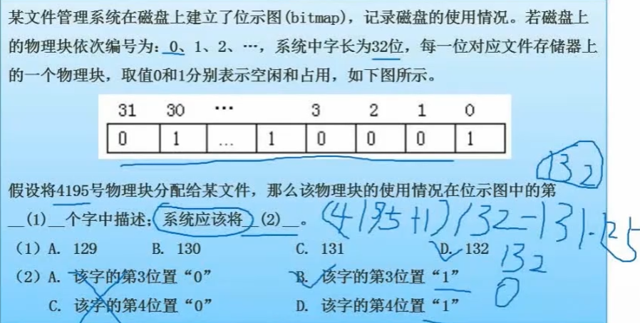

# 1 计算机组成与结构
## 1.1数的表示
### 原码补码反码移码
**原码**

范围：-(pow(2,n-1)-1)~pow(2,n-1)-1

1：0000 0001

-1：1000 0001

*原码的0只有0000 0000

**反码**

范围：-(pow(2,n-1)-1)~pow(2,n-1)-1

1: 0000 0001

-1: 1111 1110

符号位不变，有效位取反

有两个0

**补码**

范围：-pow(2,n-1)~pow(2,n-1)-1

1：0000 0001

-1：1111 1111

只有1个0：0000 0000

### 浮点数表示

N=M*R^e

M:尾数

R:基数

e:指数

计算过程：对阶->尾数计算->规范化

## 1.2 CPU结构

ALU:

AC:

DR:

PSW:存储运算过程中的标志位

PC:存储下一条指令的地址

IR:

指令译码器:

时许部件:

## 1.3 计算机体系结构分类Flynn

## 1.4 CISC and RISC

RISC特点：

## 1.5 流水线
### **流水线执行时间计算**
取指->分析->执行

流水线周期:max(取指,分析,执行)

一条指令执行时间+(n-1)*流水线周期

### **吞吐率计算**
TP=指令条数/流水线执行时间

max_TP=1/流水线周期

### **加速比**
S=不使用流水线的执行时间/使用流水线的执行时间

### **流水线效率**

## 1.6 层次化存储结构

### **Cache的基本概念**
使用"Cache+主存"的系统的平均周期为t3

Cache周期时间为t1

主存周期时间t2

访问命中率h

t3=h*t1+(1-h)*t2

### **局部性原理**

**时间局部性**:如果程序中的某条指令一旦执行，不久以后该指令可能再次执行;如果某数据被访问过，不久以后该数据可能再次被访问。产生时间局部性的典型原因，是由于在程序中存在着大量的循环操作。

**空间局部性**:一旦程序访问了某个存储单元，在不久之后，其附近的存储单元也将被访问，即程序在一段时间内所访问的地址，可能集中在一定的范围之内，这是因为指令通常是顺序存放、顺序执行的，数据也一般是以向量、数组、表等形式簇聚存储的。

**工作集理论**:工作集是进程运行时被频繁访问的页面集合

### 1.6.1 随机存储器和只读存储器
### 分类

### 主存的编址

### 磁盘工作原理

视频特殊题！

存取时间=寻道时间+等待时间(平均定位时间+转动延迟)
### 1.6.2 计算机总线
根据总线所处位置不同，可以分为：

·内部总线

·系统总线

(1)数据总线

(2)地址总线

(3)控制总线

·外部总线

### 1.6.3 串并联可靠度计算

## 1.7 校验码

### 1.7.1 基本概念

### 1.7.2 循环校验CRC

### 1.7.3 海明校验码

# 2 程序语言
## 2.1编译过程

编译型语言:

解释型语言:

**编译过程**

词法分析:非法字符，关键字或标识符拼写错误

语法错误:语法结构出错，if，endif不匹配

语义错误:死循环，零除数，其他逻辑错误

## 2.2 文法
# 3 OS
## 3.1 进程状态转换图

五态模型： 加入了人为挂起

## 3.2 前驱图
表示活动的先后关系

## 3.3 同步与互斥
一些PV操作的题，自己做吧

## 3.4 进程管理
**死锁四大条件**

·互斥

·保持和等待

·不剥夺

·环路等待

**死锁的预防**

打破四大条件

**死锁的避免**

资源有序分配

银行家算法

### 3.4.1 银行家算法*

答案：C

## 3.5 存储管理
### 3.5.1 分区存储组织

**首次适应算法**

**最佳适应算法**

**最差适应法**

**循环首次适应法**

### 3.5.2 页式，段式，段页式存储
页式

高级程序语言使用逻辑地址

运行状态，内存中使用物理地址

段式

段页式

先分段再分页

### 3.5.3 页面淘汰算法

OPT()

FIFO()

LRU()

## 3.6 文件管理
### 3.6.1 位示图
位示图用于表示物理块的存储情况，若字长为32位，则一个字可以表示32个物理块的存储情况

字从1开始算

位置从0开始算
### 3.6.1 索引文件结构

索引节点默认为13个，即13个32bit地址

直接：索引直接存储物理盘块地址

二级：索引指向一个用于存储盘块地址的盘块

三次：二的基础上继续
### 3.6.2 树型目录结构

对于F2而言，现在目录位于D1

绝对路径：/D1/W2

相对路径：W2/
## 3.7 设备管理
### 3.7.1 数据传输控制方式

程序控制(查询)方式：CPU主动查询外设的状态，在外设准备好时传输数据

程序中断方式：外设向CPU传送状态

DMA方式：由DMA控制器接管CPU和外设的数据传输工作
### 3.7.2 磁盘调度经典例题
访问一个数据块的时间=寻道时间+旋转延迟时间+传输时间

（1）磁盘块与缓冲区

从盘块读入缓冲区t1

从缓冲区送至用户区t2

系统数据处理时间t3

·单缓冲区

·双缓冲区

（2）磁盘调度算法

·FCFS

·SSTF

·SCAN

·CSCAN

## 3.8 作业管理
前驱图知识
# 4 软件工程

## 4.1
# 5 系统开发与运行

# 6 网络与多媒体
## 6.1 ISO/OSI
### 6.1.1 OSI/RM 七层模型

## 6.2 网络互联硬件
## 6.3 网络协议

## 多媒体计算机
表示媒体：XX编码

表现媒体：信息输入输出的媒体

感觉媒体：直接作用于人体感官的，使人直接产生感觉的媒体

存储媒体：硬盘，软盘，光盘，胶卷

传输媒体：电缆，光缆
# 7 数据库
## 7.1 基础知识
### 7.1.1 三级模式

内模式：数据存储到物理文件，文件存储模式

模式：表，表数据分成若干张表

外模式：用户视图，表中涵盖的信息太多，只需取出一部分

### 7.1.2 设计过程

### 7.1.3 数据库访问方式

### 7.1.4 锁

### 7.1.5 分布式数据库

## 7.2
# 8 算法与数据结构
# 8.1 线性结构
# 9 面向对象
## 9.1 基本概念
### 9.1.1 多态
**多态**:在面向对象方法中，多态是指客户类无需知道所调用方法的特定子类的实现。这就意味着客户类只需发送高层次的通用消息，具体实现根据接收对象的具体情况与现实的方法进行连接，即动态绑定

**覆盖**:子类用适合于自己要求的实现去置换父类中相应的实现

**重载**:一个类

**参数多态**:方法名称相同，但是参数不同

**包含多态**:同样的操作可以用于一个类型及其子类型，子类泛型化

**强制多态**:编译程序通过语义操作，把操作对象的类型强行加以变换

**过载多态**:同一个名在不同上下文中有不同的类型

### 9.1.2 绑定
动态绑定:执行期间判断所引用对象的实际类型，根据其实际的类型调用其相应的方法

静态绑定:编译过程中，把函数调用与响应调用所需的代码结合的过程
### 9.1.3 面向对象分析
·认定对象

·组织对象

·描述对象间的相互作用

·定义对象的操作

·定义对象的内部信息

### 9.1.4 父类与子类

## 9.2 设计原则

## 9.3 设计模式

### 9.3.1 创建型模式
# 10 知识产权

# 11 专业英语

# 12 信息安全
## 12.1 信息系统安全属性
保密性：最小授权原则，防暴露，信息加密，物理保密

完整性：安全协议，校验码，密码校验，数字签名，公证

可用性：综合保障（IP过滤，业务流控制，路由选择控制，审计跟踪）

不可抵赖性：数字签名
## 12.2 对称加密和非对称加密
### 12.2.1 对称加密
**DES**: 替换+移位

**3DES**: 三重DES，两个密钥

加密: K1加密->K2解密->K1加密

解密：K1解密->K2加密->K1解密

**AES**:高级加密标准Rijndae加密法，是美国联邦政府采用的一种区块加密标准

**RC-5**:RSA数据安全公司

**IDEA算法**:128位密钥，64位数据块

### 12.2.2 非对称加密
**RSA**:

**Elganmal**:

**ECC**:

## 12.3 信息摘要
## 12.4 数字签名
## 12.5 数字证书
### 12.5.1 数字信封
### 12.5.2 PGP
承认两种不同的证书格式：PGP证书和X.509证书

**X.509**:RSA

**国密SM2**:ECC
### 12.6 各个网络层次的安全保障

